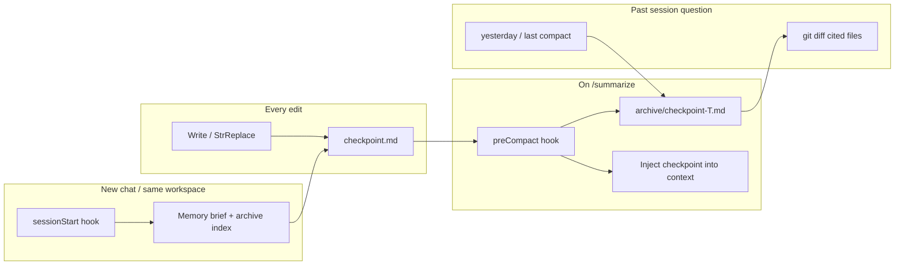

# Cursor Agent Stack

**Session memory, context budget, and engineering defaults for Cursor IDE + CLI.**

Mechanical hooks + slim rules — not a 12-phase workflow. Survive `/summarize` without amnesia. Ask "what broke yesterday?" without re-explaining folder paths.

---

## The problem

| Pain | What happens |
|------|----------------|
| Context hits 50%+ | Output quality drops |
| `/summarize` (Cursor's compact) | Same session, but agent forgets files, goals, failed attempts |
| New chat next day | Start from zero unless you handoff-paste |

## The fix



**Three layers:**

1. **Rolling checkpoint** — goal, files touched, git delta (updated on every edit)
2. **Compact archives** — snapshot on each `/summarize` (newest 10, max 7 days)
3. **Always-on rules** — agent already knows paths; no "go read this folder" reminders

---

## Quick install

**Requirements:** [Cursor](https://cursor.com) with Agent hooks, **Node.js 18+**, `cursor.agent.enableThirdPartyConfigs: true` in Cursor settings.

### Windows (PowerShell)

```powershell
git clone https://github.com/YOUR_USER/cursor-agent-stack.git
cd cursor-agent-stack
.\install.ps1
```

### macOS / Linux

```bash
git clone https://github.com/YOUR_USER/cursor-agent-stack.git
cd cursor-agent-stack
chmod +x install.sh && ./install.sh
```

Then **reload Cursor** (Developer → Reload Window).

### Enable project hooks in IDE

Cursor Settings → search **third party** → enable **`cursor.agent.enableThirdPartyConfigs`**.

---

## What you get

| Component | Purpose |
|-----------|---------|
| **Hooks** (`~/.cursor/hooks/`) | Checkpoint update, preCompact archive, sessionStart rehydration, secret-guard |
| **Rules** (`~/.cursor/rules/`) | Session memory, context budget, engineering defaults, no-secret reads |
| **Skills** | `caveman` (terse output), `rtk` (compressed CLI — needs RTK binary) |
| **CLI HUD** (`statusline.js`) | Context bar, model, git branch, compact warning at 50%+ |
| **Project template** | `.cursor/session/.gitignore` for repos |

### CLI HUD (preview)

```
[CAV:ULTRA] | Composer ████████░░░░ 48%  ↻ compact | content-audit git:(main*) 
```

---

## Session files (per workspace)

| Workspace | Path |
|-----------|------|
| Project repo | `<repo>/.cursor/session/` |
| Home folder | `~/.cursor/session/` |

| File | Role |
|------|------|
| `checkpoint.md` | Live state — continue current work |
| `archive/checkpoint-*.md` | One snapshot per `/summarize` |
| `hook-audit.log` | Debug: did hooks fire? |

**Add to each repo** (optional, one-time):

```powershell
Copy-Item project-template\.cursor\session\.gitignore YOUR_REPO\.cursor\session\ -Force
```

---

## Behavior cheat sheet

| Event | What happens |
|-------|----------------|
| Every edit | Rolling `checkpoint.md` updated |
| `/summarize` or `/compact` | Refresh checkpoint + copy to `archive/` |
| New Agent chat | Inject memory brief + latest checkpoint |
| "Yesterday's session broke X" | Agent reads `archive/` — no path coaching |

---

## Customize

Edit `~/.cursor/rules/global-engineering.mdc` — add your project names, stacks, deploy targets.

Turn off caveman: say **"normal mode"** in chat.

---

## Not included (by design)

- Full Machina / phase-gate harness
- Pass ceilings or TDD enforcement loops
- Headroom MCP
- "End session" LLM snapshot skill (planned optional add-on)
- Domain skills (security-audit, playwright) — keep project-local

---

## Troubleshooting

| Symptom | Fix |
|---------|-----|
| Hooks never run | Enable `enableThirdPartyConfigs`, reload window |
| No archive after summarize | Check `hook-audit.log` for `preCompact` |
| Agent asks "which folder?" | Reload — `session-memory` rule should be active |
| Secret guard blocked a write | Use env vars, not literals in code |

---

## Architecture

See [docs/ARCHITECTURE.md](docs/ARCHITECTURE.md).

---

## License

MIT — see [LICENSE](LICENSE).

---

## Credits

Built from real daily-driver Cursor setup — session checkpointing, compact archives, token efficiency, secret guard. PRs welcome.
