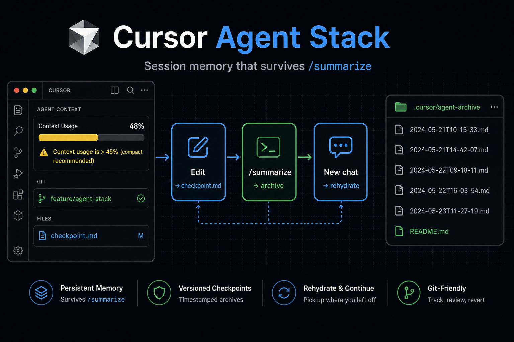
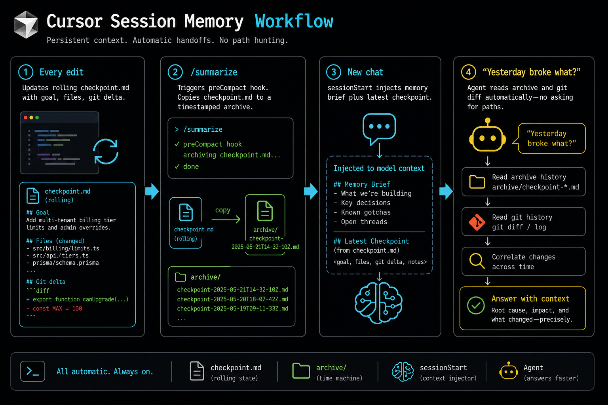

<p align="center">
  
</p>

<h1 align="center">Cursor Agent Stack</h1>

<p align="center">
  <strong>Session memory, context budget, and optional design modules for Cursor IDE + CLI.</strong><br/>
  Mechanical hooks + slim rules — survive <code>/summarize</code> without amnesia.
</p>

<p align="center">
  <a href="LICENSE"></a>
  <a href="https://cursor.com"></a>
  <a href="https://nodejs.org"></a>
  <a href="https://github.com/darkyzowo/cursor-agent-stack/releases/tag/v0.4.0"></a>
</p>

<p align="center">
  <a href="https://github.com/darkyzowo">@darkyzowo</a>
</p>



---

## Stack at a glance

| Layer | Install | What you get |
|-------|---------|--------------|
| **Global** | `install.ps1` | Session memory hooks, secret-guard, rules, caveman + RTK skills, CLI HUD |
| **2D frontend** | `project-template/install-frontend.ps1` | Impeccable, ui-ux-pro-max, dashboard design-refs |
| **3D / WebGL** | `project-template/install-3d.ps1` | r3f-three skill, react-three-fiber CSV, ProofScene gate |
| **Hybrid** | Both installers | [HYBRID.md](docs/HYBRID.md) — lane routing for UI + R3F |

Global stays lean. Project modules opt in per repo.

---

## Why this exists

Cursor's `/summarize` compresses the chat — but the agent still **forgets** files, goals, and failed attempts.

| Pain | Fix |
|------|-----|
| Context **50%+** → quality drops | Context budget rules + CLI HUD `↻ compact` |
| `/summarize` amnesia | `preCompact` archives + re-injects checkpoint |
| "What broke yesterday?" | Agent reads `.cursor/session/archive/` |
| 2D UI slop | Impeccable + design-refs (per repo) |
| 3D black canvas / wrong lane | r3f-three proof gate + stack CSV (per repo) |



---

## Quick install

**Requirements:** [Cursor](https://cursor.com) hooks · **Node 18+** · Python 3.10+ (ui-ux lookup) · `enableThirdPartyConfigs: true`

### Global

```powershell
git clone https://github.com/darkyzowo/cursor-agent-stack.git
cd cursor-agent-stack
.\install.ps1
.\scripts\verify.ps1
```

```bash
chmod +x install.sh scripts/verify.sh && ./install.sh && ./scripts/verify.sh
```

Reload Cursor after enabling third-party agent configs.

### Per repo (from YOUR app root)

```powershell
& "C:\path\to\cursor-agent-stack\project-template\install-frontend.ps1"  # 2D
& "C:\path\to\cursor-agent-stack\project-template\install-3d.ps1"        # 3D
```

Docs index: [docs/README.md](docs/README.md)

---

## Modules

**2D** — [FRONTEND.md](docs/FRONTEND.md): Impeccable, ui-ux-pro-max, design-refs. Pilot: Next.js dashboard.

**3D** — [3D.md](docs/3D.md): r3f-three, ProofScene gate, react-three-fiber CSV.

**Hybrid** — [HYBRID.md](docs/HYBRID.md): both installers + lane routing.

---

## Verify

```powershell
.\scripts\verify.ps1
```

CI: `.github/workflows/verify.yml` on push/PR.

---

## Releases

[CHANGELOG.md](CHANGELOG.md) · current **v0.4.0**

| Version | Highlights |
|---------|------------|
| **v0.4.0** | Full-stack docs, VERSION file, README consolidation |
| **v0.3.1** | Bundle split, hybrid routing, verify CI |
| **v0.3.0** | 3D / R3F module |
| **v0.2.0** | Frontend / Impeccable module |
| **v0.1.0** | Session memory core |

---

## Not included

Machina harness, global Impeccable/r3f-three, vendored Impeccable (use `npx impeccable install`).

Details: [ARCHITECTURE.md](docs/ARCHITECTURE.md)

---

## Author

<p align="center">
  <a href="https://github.com/darkyzowo"><strong>@darkyzowo</strong></a>
</p>

## License

MIT — [LICENSE](LICENSE)

---

## Global components

| Component | Role |
|-----------|------|
| Hooks | Checkpoint, compact, rehydrate, secret-guard |
| Rules | Session memory, context budget, engineering defaults |
| Pointers | `frontend-design-pointer`, `3d-interactive-pointer` |
| Skills | caveman, RTK |
| CLI HUD | `statusline.js` — context bar, compact warning |

### Checkpoint + archives

- `checkpoint.md` — rolling state (goal, files, git)
- `archive/checkpoint-*.md` — per `/summarize` (max 10, 7 days)

---

## Troubleshooting

| Symptom | Fix |
|---------|-----|
| Hooks never run | `enableThirdPartyConfigs` + reload |
| No archive after summarize | `hook-audit.log` → `preCompact` |
| 3D black canvas | ProofScene first — [3D.md](docs/3D.md) |
| Wrong design lane | [HYBRID.md](docs/HYBRID.md) |
| Secret guard blocked write | Env vars, not literals |
