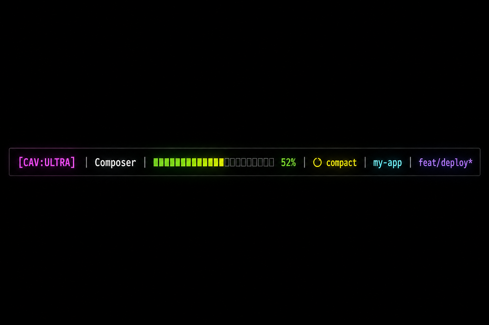
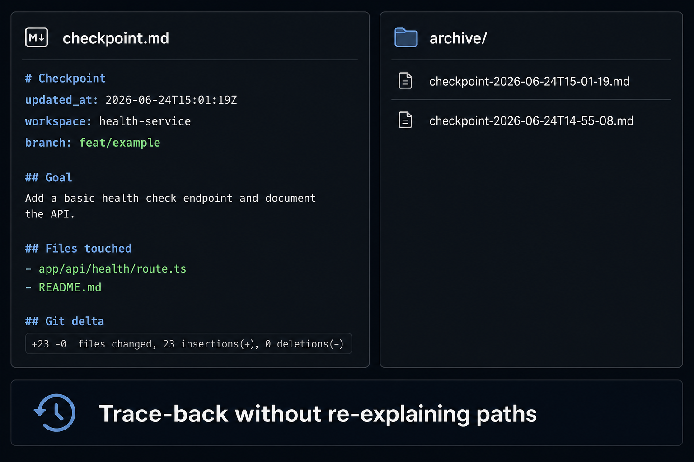
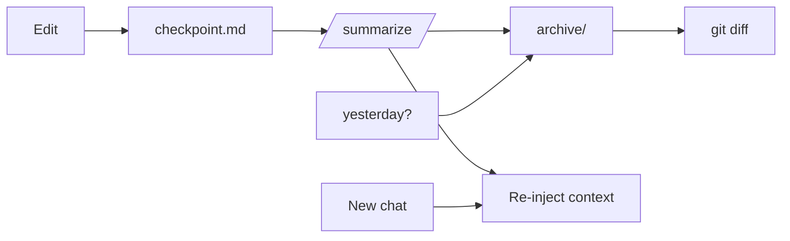

<p align="center">
  
</p>

<h1 align="center">Cursor Agent Stack</h1>

<p align="center">
  <strong>Session memory, context budget, and engineering defaults for Cursor IDE + CLI.</strong><br/>
  Mechanical hooks + slim rules — survive <code>/summarize</code> without amnesia.
</p>

<p align="center">
  <a href="LICENSE"></a>
  <a href="https://cursor.com"></a>
  <a href="https://nodejs.org"></a>
</p>

<p align="center">
  <a href="https://github.com/darkyzowo">@darkyzowo</a>
</p>


---

## Why this exists

Cursor’s `/summarize` compresses the chat — but the agent still **forgets** files, goals, and failed attempts. You end up re-explaining paths or handoff-pasting.

**Cursor Agent Stack** adds mechanical session memory:

| Pain | Fix |
|------|-----|
| Context hits **50%+** → quality drops | Context budget rules + CLI HUD warns `↻ compact` |
| `/summarize` → same session amnesia | `preCompact` hook archives state + re-injects checkpoint |
| “What broke yesterday?” → path coaching | Agent already knows `.cursor/session/archive/` |


---

## What you get

| Layer | What | Where |
|-------|------|--------|
| **Hooks** | Checkpoint update, compact archive, rehydrate, secret-guard | `~/.cursor/hooks/` |
| **Rules** | Session memory, context budget, engineering defaults | `~/.cursor/rules/` |
| **Skills** | Caveman (terse output), RTK (compressed CLI*) | `~/.cursor/skills/` |
| **CLI HUD** | Context bar, model, git, compact warning | `statusline.js` |

\*RTK skill documents wrappers — [install RTK](https://github.com) separately if you use it.

### CLI HUD



Live strip in Cursor CLI — context % turns yellow at **50%+** with `↻ compact`.

### Checkpoint + archives



- **`checkpoint.md`** — rolling live state (goal, files, git delta)
- **`archive/checkpoint-*.md`** — one snapshot per `/summarize` (newest **10**, max **7 days**)
- Agent reads archives for “yesterday / last compact” — **no folder reminders**

---

## Quick install

**Requirements:** [Cursor](https://cursor.com) Agent hooks · **Node.js 18+** · `cursor.agent.enableThirdPartyConfigs: true`

### Windows

```powershell
git clone https://github.com/darkyzowo/cursor-agent-stack.git
cd cursor-agent-stack
.\install.ps1
```

### macOS / Linux

```bash
git clone https://github.com/darkyzowo/cursor-agent-stack.git
cd cursor-agent-stack
chmod +x install.sh && ./install.sh
```

**Then:** Cursor Settings → enable **third-party agent configs** → **Reload Window**.

Optional per repo:

```powershell
mkdir .cursor\session -Force
Copy-Item project-template\.cursor\session\.gitignore .cursor\session\
```

---

## Behavior

| Event | What happens |
|-------|----------------|
| **Every edit** | Rolling `checkpoint.md` updated |
| **`/summarize` / `/compact`** | Refresh checkpoint + copy to `archive/` |
| **New Agent chat** | Inject memory brief + latest checkpoint |
| **Past session question** | Agent reads `archive/` + git — automatically |



---

## Session paths

| Workspace | Folder |
|-----------|--------|
| Project repo | `<repo>/.cursor/session/` |
| Home directory | `~/.cursor/session/` |

| File | Role |
|------|------|
| `checkpoint.md` | Continue **now** |
| `archive/checkpoint-*.md` | Trace-back / forensics |
| `hook-audit.log` | Verify hooks fired |

---

## Customize

Edit `~/.cursor/rules/global-engineering.mdc` — add your projects, stacks, deploy targets.

Say **"normal mode"** to disable caveman terse output.

---

## Not included (by design)

- Full Machina / phase-gate harness
- Pass ceilings or mandatory TDD loops
- Headroom MCP
- “End session” LLM snapshot (may add later)
- Domain skills (security, playwright) — keep **project-local**

---

## Troubleshooting

| Symptom | Fix |
|---------|-----|
| Hooks never run | Enable `enableThirdPartyConfigs`, reload |
| No archive after summarize | Check `hook-audit.log` for `preCompact` |
| Agent asks “which folder?” | Reload — `session-memory` rule should be active |
| Secret guard blocked a write | Use env vars, not literals |

Details: [docs/ARCHITECTURE.md](docs/ARCHITECTURE.md)

---

## Author

<p align="center">
  <br/>
  <a href="https://github.com/darkyzowo"><strong>@darkyzowo</strong></a><br/>
  Built from a daily-driver Cursor setup — battle-tested on real repos.
</p>

## License

MIT — see [LICENSE](LICENSE). PRs welcome.
